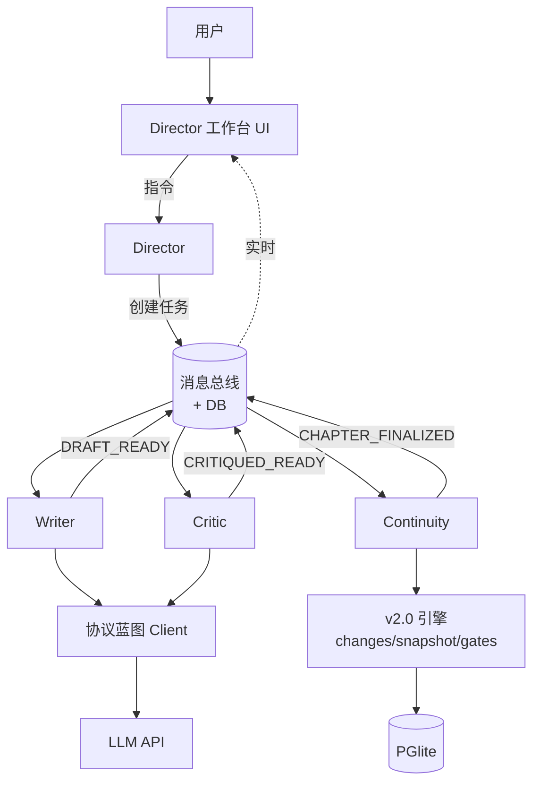

# Design Document

CLwriter v3.0 — 多 Agent 协作小说创作系统

## 一、概述

本文档为 [requirements.md](./requirements.md) 的技术实现方案。三阶段渐进推进,每阶段都能产出可发布版本。

**当前 spec 重点:阶段 1 (MVP)**, 阶段 2/3 给出概要设计供后续 spec 细化。

## 二、阶段 1 (MVP) 详细设计

### 2.1 阶段 1 范围

| Agent | 是否实现 | 备注 |
|-------|---------|------|
| Director | ✅ | 简化版: 不解析复杂自然语言,只支持模板化指令 |
| Writer | ✅ | 流式输出,支持 CHANGES 协议 |
| Critic | ✅ | 4 维评分,简化版打回逻辑 |
| Continuity | ✅ | 复用 v2.0 6 道门禁 |
| ChapterPlanner | 🔵 占位 | 阶段 1 用静态模板,阶段 3 实现 |
| Humanizer | ⛔ | 阶段 2 |
| Memory | 🔵 简化版 | 仅 L1+L3 (尾段+快照) |
| Anchor | ⛔ | 阶段 2 |
| Timekeeper | ⛔ | 阶段 3,时间一致性由 Continuity 兼任 |
| WorldBuilder/Character/Outliner | ⛔ | 阶段 3,用户手动填表 |

### 2.2 整体架构



### 2.3 模块划分

```
src/
├── lib/
│   ├── agents/                    # 🆕 新增 Agent 模块
│   │   ├── core/
│   │   │   ├── agent.ts           # Agent 抽象基类
│   │   │   ├── bus.ts             # 消息总线 (in-memory + DB)
│   │   │   ├── orchestrator.ts    # 流水线编排器
│   │   │   ├── events.ts          # 标准事件常量
│   │   │   ├── errors.ts          # 错误码常量
│   │   │   └── types.ts           # 共享类型 (Task/Message/Pack)
│   │   ├── director/
│   │   │   ├── index.ts           # Director Agent
│   │   │   ├── intent-parser.ts   # 意图解析 (MVP: 模板匹配)
│   │   │   └── prompts.ts
│   │   ├── writer/
│   │   │   ├── index.ts           # Writer Agent
│   │   │   ├── stream.ts          # 流式 chunk 处理
│   │   │   └── prompts.ts
│   │   ├── critic/
│   │   │   ├── index.ts           # Critic Agent
│   │   │   ├── scoring.ts         # 4 维评分
│   │   │   └── prompts.ts
│   │   └── continuity/
│   │       ├── index.ts           # Continuity Agent
│   │       └── transaction.ts     # 原子事务封装
│   │
│   ├── engine/                    # 🟢 保留 v2.0 引擎
│   │   ├── changes/               # CHANGES 协议
│   │   ├── snapshot/              # 15 维快照
│   │   ├── gates/                 # 6 道门禁
│   │   ├── pack/                  # 数据中心打包 (MVP 简化版)
│   │   └── prompts/
│   │
│   ├── ai/protocol/               # 🟢 保留协议蓝图
│   │
│   └── db/
│       ├── schema.ts              # 🔄 扩展: 新增 agent_tasks 等
│       └── migrations/
│
├── components/
│   ├── workbench/                 # 🆕 Director 工作台
│   │   ├── DirectorWorkbench.tsx  # 主容器
│   │   ├── ChatPanel.tsx          # 对话框
│   │   ├── PipelineStatus.tsx     # 流水线进度
│   │   ├── StreamPreview.tsx      # 流式预览
│   │   └── AgentDrawer.tsx        # Agent 详情抽屉
│   │
│   ├── sidebar/
│   │   ├── ProjectTree.tsx        # 🆕 简化项目树
│   │   └── (旧文件砍除,见 Req 16)
│   │
│   ├── engine/                    # 🟢 v2.0 面板复用
│   │   ├── FactSnapshotPanel.tsx
│   │   ├── EntityManagerPanel.tsx
│   │   └── GateLogPanel.tsx
│   │
│   └── settings/                  # 🟢 协议蓝图设置保留
│
└── hooks/
    ├── useTaskStream.ts           # 🆕 订阅总线
    ├── useAgentStatus.ts          # 🆕 Agent 状态
    └── useChapterDraft.ts         # 🆕 占位章节管理
```

### 2.4 核心抽象

#### 2.4.1 Agent 基类

```typescript
// lib/agents/core/agent.ts

export interface AgentContext {
    projectId: string
    parentTaskId: string  // 父任务 (主流水线)
    taskId: string        // 自己的任务 ID
    bus: MessageBus
    abortSignal: AbortSignal
    promptOverride?: string  // 专家模式覆盖
}

export interface AgentResult<T = unknown> {
    success: boolean
    output?: T
    error?: { code: string; message: string }
    metrics?: { tokens: number; durationMs: number }
}

export abstract class BaseAgent<TInput, TOutput> {
    abstract readonly name: string
    abstract readonly stage: 1 | 2 | 3   // 实施阶段
    
    /** 主入口,由 Orchestrator 调用 */
    async execute(ctx: AgentContext, input: TInput): Promise<AgentResult<TOutput>> {
        const startedAt = Date.now()
        try {
            await this.publishStart(ctx, input)
            const output = await this.run(ctx, input)
            const result = { success: true, output, metrics: { tokens: 0, durationMs: Date.now() - startedAt } }
            await this.publishDone(ctx, result)
            return result
        } catch (e) {
            const error = this.normalizeError(e)
            await this.publishFailed(ctx, error)
            return { success: false, error, metrics: { tokens: 0, durationMs: Date.now() - startedAt } }
        }
    }
    
    /** 子类实现具体逻辑 */
    protected abstract run(ctx: AgentContext, input: TInput): Promise<TOutput>
    
    /** 子类可覆盖,定义 prompt 模板 */
    protected getSystemPrompt(ctx: AgentContext): string {
        return ctx.promptOverride || this.defaultSystemPrompt()
    }
    
    protected abstract defaultSystemPrompt(): string
    
    private async publishStart(ctx: AgentContext, input: TInput) {
        await ctx.bus.publish({
            type: `${this.name.toUpperCase()}_STARTED`,
            taskId: ctx.taskId,
            payload: { input }
        })
    }
    
    private async publishDone(ctx: AgentContext, result: AgentResult<TOutput>) {
        await ctx.bus.publish({
            type: `${this.name.toUpperCase()}_DONE`,
            taskId: ctx.taskId,
            payload: result
        })
    }
    
    private async publishFailed(ctx: AgentContext, error: { code: string; message: string }) {
        await ctx.bus.publish({
            type: `${this.name.toUpperCase()}_FAILED`,
            taskId: ctx.taskId,
            payload: { error }
        })
    }
    
    private normalizeError(e: unknown): { code: string; message: string } {
        if (e instanceof Error) {
            return { code: 'E_UNKNOWN', message: e.message }
        }
        return { code: 'E_UNKNOWN', message: String(e) }
    }
}
```

#### 2.4.2 消息总线

```typescript
// lib/agents/core/bus.ts

export interface BusMessage {
    id?: string  // DB 自动填充
    type: string  // 事件名
    taskId: string
    timestamp?: Date
    payload?: unknown
}

export type MessageHandler = (msg: BusMessage) => void | Promise<void>

export class MessageBus {
    private handlers: Map<string, Set<MessageHandler>> = new Map()
    private uiSubscribers: Set<(msg: BusMessage) => void> = new Set()
    
    /** 订阅特定事件类型 (Agent 使用) */
    on(eventType: string, handler: MessageHandler): () => void {
        if (!this.handlers.has(eventType)) this.handlers.set(eventType, new Set())
        this.handlers.get(eventType)!.add(handler)
        return () => this.handlers.get(eventType)?.delete(handler)
    }
    
    /** 订阅所有消息 (UI 实时显示用) */
    subscribeAll(handler: (msg: BusMessage) => void): () => void {
        this.uiSubscribers.add(handler)
        return () => this.uiSubscribers.delete(handler)
    }
    
    /** 发布消息 — 流式 chunk 不持久化,语义级事件持久化 */
    async publish(msg: BusMessage): Promise<void> {
        const enriched: BusMessage = { ...msg, timestamp: new Date() }
        
        // 1. UI 立即响应
        for (const sub of this.uiSubscribers) sub(enriched)
        
        // 2. 持久化 (只对语义级事件,流式 chunk 跳过)
        if (!this.isStreamChunk(msg.type)) {
            await this.persist(enriched)
        }
        
        // 3. 触发 Agent 订阅
        const handlers = this.handlers.get(msg.type) || new Set()
        await Promise.all([...handlers].map(h => Promise.resolve(h(enriched))))
    }
    
    private isStreamChunk(type: string): boolean {
        return type === 'WRITER_CHUNK' || type === 'STREAM_CHUNK'
    }
    
    private async persist(msg: BusMessage): Promise<void> {
        // 写入 agent_messages 表
        const db = await getDatabase()
        await db.insert(agentMessages).values({
            taskId: msg.taskId,
            type: msg.type,
            payload: msg.payload as object,
            createdAt: msg.timestamp!
        })
    }
}
```

#### 2.4.3 流水线编排器

```typescript
// lib/agents/core/orchestrator.ts

export interface PipelineStep {
    name: string
    agent: BaseAgent<unknown, unknown>
    dependsOn?: string[]  // 用于 Req 1.9 并行检测
    skipCondition?: (ctx: AgentContext, taskOutputs: Record<string, unknown>) => boolean
}

export class Orchestrator {
    constructor(private bus: MessageBus, private interventionMode: 'auto' | 'review' | 'expert') {}
    
    /**
     * 阶段 1 流水线: Writer → Critic → Continuity
     */
    async runMVP(parentTask: Task, input: { blueprint: ChapterBlueprint }): Promise<void> {
        const steps: PipelineStep[] = [
            { name: 'writer', agent: writerAgent },
            { name: 'critic', agent: criticAgent },
            { name: 'continuity', agent: continuityAgent }
        ]
        
        const outputs: Record<string, unknown> = { blueprint: input.blueprint }
        
        for (const step of steps) {
            // 1. 取消检查
            if (parentTask.status === 'cancelled') break
            
            // 2. 跳过检查
            if (step.skipCondition?.(this.makeCtx(parentTask, step.name), outputs)) continue
            
            // 3. 干预模式: 等待用户确认
            if (this.interventionMode === 'review') {
                await this.waitForUserConfirm(parentTask.id, step.name)
            }
            
            // 4. 执行 Agent
            const ctx = this.makeCtx(parentTask, step.name)
            const result = await step.agent.execute(ctx, this.buildInput(step.name, outputs))
            
            // 5. 失败 → Director 决策
            if (!result.success) {
                const decision = await directorAgent.handleFailure(ctx, step.name, result.error!)
                if (decision === 'retry') {
                    // 简单重试一次
                    const retry = await step.agent.execute(ctx, this.buildInput(step.name, outputs))
                    if (!retry.success) return await this.markPendingReview(parentTask, step.name, retry.error!)
                    outputs[step.name] = retry.output
                } else if (decision === 'abort') {
                    return await this.markPendingReview(parentTask, step.name, result.error!)
                }
            } else {
                outputs[step.name] = result.output
            }
        }
        
        // 6. 全部完成
        await this.bus.publish({ type: 'CHAPTER_FINALIZED', taskId: parentTask.id, payload: outputs })
    }
    
    private makeCtx(parent: Task, stepName: string): AgentContext { /* ... */ }
    private buildInput(stepName: string, outputs: Record<string, unknown>): unknown { /* ... */ }
    private waitForUserConfirm(taskId: string, stepName: string): Promise<void> { /* ... */ }
    private markPendingReview(task: Task, failedStep: string, error: { code: string; message: string }): Promise<void> { /* ... */ }
}
```

### 2.5 各 Agent 详细设计

#### 2.5.1 Director Agent (MVP 简化版)

**职责:**
- 接收用户指令 (MVP: 只支持模板化指令,如"生成下一章")
- 创建主流水线父任务
- 处理 Agent 失败 (重试 / 上报)
- 生成最终摘要展示给用户

**MVP 简化:**
- 不解析复杂自然语言,只支持: `generate-next-chapter` / `regenerate-chapter` / `review-pending`
- 不主动询问用户,所有决策有默认行为

**核心方法:**
```typescript
class DirectorAgent extends BaseAgent<DirectorInput, DirectorOutput> {
    name = 'director'
    stage = 1 as const
    
    /** 创建主流水线父任务 */
    async startGenerateChapter(projectId: string, options: { instruction?: string }): Promise<Task> {
        // 1. 检查 D5 前置条件
        await this.checkPrerequisites(projectId)
        
        // 2. 创建 draft 章节占位
        const chapter = await createChapterPlaceholder(projectId)
        
        // 3. 创建父任务
        const task = await createTask({
            projectId,
            type: 'generate-chapter',
            chapterId: chapter.id,
            input: { instruction: options.instruction }
        })
        
        // 4. 启动编排
        const orchestrator = new Orchestrator(this.bus, getInterventionMode())
        orchestrator.runMVP(task, { blueprint: this.makeStaticBlueprint(projectId, chapter) })
            .catch(e => console.error('[Director] Pipeline error:', e))
        
        return task
    }
    
    /** 处理 Agent 失败 */
    async handleFailure(ctx: AgentContext, stepName: string, error: AgentError): Promise<'retry' | 'abort'> {
        // MVP: 简单策略 — 网络错误重试,逻辑错误打回用户
        const retryableCodes = ['E_LLM_TIMEOUT', 'E_LLM_RATELIMIT']
        if (retryableCodes.includes(error.code)) return 'retry'
        return 'abort'
    }
    
    /** 检查前置条件 (D5) */
    private async checkPrerequisites(projectId: string): Promise<void> {
        const l1Chars = await getL1Characters(projectId)
        if (l1Chars.length === 0) {
            throw makeError('E_NO_PREREQUISITE', '请先创建至少 1 个 L1 主角')
        }
        const constraints = await getWorldConstraints(projectId)
        if (constraints.length === 0) {
            throw makeError('E_NO_PREREQUISITE', '请先添加至少 1 条世界观规则')
        }
    }
}
```

#### 2.5.2 Writer Agent

**职责:**
- 接收 blueprint + memoryPack
- 调用 LLM 流式生成正文 + CHANGES
- CHANGES 解析失败时自重试 (Req 4.4)

**实现要点:**
```typescript
class WriterAgent extends BaseAgent<WriterInput, WriterOutput> {
    name = 'writer'
    stage = 1 as const
    
    protected async run(ctx: AgentContext, input: WriterInput): Promise<WriterOutput> {
        const systemPrompt = this.buildSystemPrompt(input)
        const userPrompt = this.buildUserPrompt(input)
        
        for (let attempt = 1; attempt <= 3; attempt++) {
            // 流式调用
            let fullText = ''
            await streamChatCompletion(
                [{ role: 'system', content: systemPrompt }, { role: 'user', content: userPrompt }],
                {
                    onChunk: (chunk) => {
                        fullText += chunk
                        // in-memory 转发到总线 (不持久化)
                        ctx.bus.publish({
                            type: 'WRITER_CHUNK',
                            taskId: ctx.taskId,
                            payload: { chunk }
                        })
                    },
                    onDone: () => {},
                    onError: (e) => { throw makeError('E_LLM_TIMEOUT', e) }
                }
            )
            
            // 解析 CHANGES
            const parsed = parseChanges(fullText)
            if (parsed.success) {
                return { body: parsed.body, changes: parsed.changes, raw: fullText }
            }
            
            // 重试时附加反馈
            userPrompt = this.appendRetryFeedback(userPrompt, parsed.error, attempt)
        }
        
        throw makeError('E_PROTOCOL_PARSE_FAILED', 'CHANGES 解析连续 3 次失败')
    }
    
    protected defaultSystemPrompt(): string {
        return PROMPT_WRITER_DEFAULT  // 引用 v2.0 的 engine/prompts/chapter
    }
}
```

#### 2.5.3 Critic Agent

**职责:**
- 4 维评分 (节奏/逻辑/文笔/爽点)
- 根据评分决策: 通过 / 局部建议 / 整章打回

**实现要点:**
```typescript
class CriticAgent extends BaseAgent<CriticInput, CriticOutput> {
    name = 'critic'
    stage = 1 as const
    
    protected async run(ctx: AgentContext, input: CriticInput): Promise<CriticOutput> {
        // 用 LLM 打分 (返回 JSON)
        const prompt = this.buildScoringPrompt(input.body, input.blueprint)
        const response = await chatCompletion([
            { role: 'system', content: this.getSystemPrompt(ctx) },
            { role: 'user', content: prompt }
        ])
        
        const scores = this.parseScores(response)
        const decision = this.makeDecision(scores)
        
        return { scores, decision, suggestions: this.buildSuggestions(scores) }
    }
    
    private makeDecision(scores: Scores): 'pass' | 'partial-rewrite' | 'full-rewrite' {
        const min = Math.min(scores.pacing, scores.logic, scores.prose, scores.satisfaction)
        if (min < 60) return 'full-rewrite'
        if (min < 80) return 'partial-rewrite'
        return 'pass'
    }
}
```

#### 2.5.4 Continuity Agent

**复用 v2.0 的 6 道门禁,改造为 Agent 接口:**
```typescript
class ContinuityAgent extends BaseAgent<ContinuityInput, ContinuityOutput> {
    name = 'continuity'
    stage = 1 as const
    
    protected async run(ctx: AgentContext, input: ContinuityInput): Promise<ContinuityOutput> {
        const { body, changes, blueprint } = input
        const prevSnapshot = await getLatestSnapshot(ctx.projectId)
        
        // 直接用 v2.0 引擎
        const orchResult = await runAllGates({
            projectId: ctx.projectId,
            chapterId: input.chapterId,
            chapterOrder: input.chapterOrder,
            parsed: { body, changes, rawChanges: '', parseError: null },
            prevSnapshot,
            entities: await getAllEntities(ctx.projectId),
            blueprint
        })
        
        if (!orchResult.overallPassed) {
            throw makeError('E_GATE_FAILED', buildGateFeedback(orchResult))
        }
        
        // 原子事务
        await this.commitTransaction(ctx, input, prevSnapshot)
        
        return { gateResults: orchResult.results, snapshotUpdated: true }
    }
    
    private async commitTransaction(ctx: AgentContext, input: ContinuityInput, prev: FactSnapshot | null) {
        const db = await getDatabase()
        // PGlite 不支持显式事务,但操作顺序保证一致性
        // 1. 更新章节文件 (draft → final)
        await updateFile(input.chapterId, { content: input.body })
        // 2. 写入 CHANGES
        await insertChapterChange(input.chapterId, input.changes)
        // 3. 投影快照
        const newSnap = projectSnapshot(prev, input.changes, input.chapterId, input.chapterOrder)
        await saveSnapshot(ctx.projectId, newSnap)
        // 4. 更新角色 appearanceCount + 触发等级升级
        await this.updateAppearanceCounts(ctx.projectId, input.changes, input.chapterOrder)
    }
}
```

### 2.6 数据库 Schema 扩展

```typescript
// lib/db/schema.ts (新增部分)

export const agentTasks = pgTable('agent_tasks', {
    id: uuid('id').primaryKey().defaultRandom(),
    projectId: uuid('project_id').notNull().references(() => projects.id, { onDelete: 'cascade' }),
    parentTaskId: uuid('parent_task_id'),  // null = 父任务,否则指向父任务 ID
    type: text('type').notNull(),  // 'generate-chapter' | 'writer' | 'critic' | ...
    status: text('status').notNull().default('pending'),  // pending/running/done/failed/cancelled
    
    chapterId: uuid('chapter_id').references(() => files.id),
    
    input: jsonb('input'),
    output: jsonb('output'),
    error: jsonb('error'),  // { code, message }
    
    metrics: jsonb('metrics'),  // { tokens, durationMs }
    
    createdAt: timestamp('created_at').defaultNow().notNull(),
    startedAt: timestamp('started_at'),
    completedAt: timestamp('completed_at'),
}, (table) => ({
    projectIdx: index('agent_tasks_project_idx').on(table.projectId),
    parentIdx: index('agent_tasks_parent_idx').on(table.parentTaskId),
    statusIdx: index('agent_tasks_status_idx').on(table.status),
}))

export const agentMessages = pgTable('agent_messages', {
    id: uuid('id').primaryKey().defaultRandom(),
    taskId: uuid('task_id').notNull().references(() => agentTasks.id, { onDelete: 'cascade' }),
    type: text('type').notNull(),  // 事件名
    payload: jsonb('payload'),
    createdAt: timestamp('created_at').defaultNow().notNull(),
}, (table) => ({
    taskIdx: index('agent_messages_task_idx').on(table.taskId),
    typeIdx: index('agent_messages_type_idx').on(table.type),
}))

export const promptOverrides = pgTable('prompt_overrides', {
    id: uuid('id').primaryKey().defaultRandom(),
    projectId: uuid('project_id').notNull().references(() => projects.id, { onDelete: 'cascade' }),
    agentName: text('agent_name').notNull(),  // 'writer' | 'critic' | ...
    promptTemplate: text('prompt_template').notNull(),
    updatedAt: timestamp('updated_at').defaultNow().notNull(),
}, (table) => ({
    uniqueIdx: uniqueIndex('prompt_overrides_unique').on(table.projectId, table.agentName),
}))

// 扩展 entities 表
// 注意: PGlite 不支持 ALTER TABLE 添加 NOT NULL 列,需要用 db migration
// 实际实现时通过 drizzle-kit 生成 migration
```

### 2.7 UI 设计 — Director 工作台

#### 2.7.1 三栏布局

```
┌──────────────────────────────────────────────────────────────────┐
│ Header: [Logo] 我的小说 ▾  [模式: 一键 ▾] [设置] [▶ 生成下一章]   │
├──────────────┬──────────────────────────────────┬────────────────┤
│ ◀ ProjectTree│ Director Workbench (中)          │ Right Panel ▶ │
│              │                                  │                │
│ 📚 当前项目  │ ┌────────────────────────────┐  │ 🤖 Agent Status│
│              │ │ Chat 历史                  │  │   Writer  ⏳   │
│ ▾ 设定       │ │ > 生成下一章               │  │   Critic  ○    │
│   • 角色档案 │ │ Director: 已启动流水线...  │  │   Continuity ○ │
│   • 世界观   │ └────────────────────────────┘  │                │
│   • 大纲     │                                  │ 📊 Pipeline    │
│              │ ┌────────────────────────────┐  │  ▌▌▌○ 33%      │
│ ▾ 章节       │ │ Pipeline Progress          │  │                │
│   ✓ 第1章   │ │ ✓ Writer (12s, 1832 tok)   │  │ 🌍 Snapshot    │
│   ✓ 第2章   │ │ ⏳ Critic 评分中...        │  │  (实时面板)    │
│   ⚡ 第3章   │ │ ○ Continuity              │  │                │
│   (草稿)     │ └────────────────────────────┘  │                │
│              │                                  │                │
│              │ ┌────────────────────────────┐  │                │
│              │ │ Stream Preview             │  │                │
│              │ │ "张三冷笑一声,望向远方..." │  │                │
│              │ │ (实时滚动)                 │  │                │
│              │ └────────────────────────────┘  │                │
└──────────────┴──────────────────────────────────┴────────────────┘
```

#### 2.7.2 关键 React Hook

```typescript
// hooks/useTaskStream.ts

export function useTaskStream(taskId: string | null) {
    const [agentStates, setAgentStates] = useState<Record<string, AgentUiState>>({})
    const [streamText, setStreamText] = useState('')
    
    useEffect(() => {
        if (!taskId) return
        
        const unsub = bus.subscribeAll((msg) => {
            if (msg.taskId !== taskId) return
            
            // Agent 状态变化
            if (msg.type.endsWith('_STARTED')) {
                const agent = msg.type.replace('_STARTED', '').toLowerCase()
                setAgentStates(s => ({ ...s, [agent]: { status: 'running', startedAt: msg.timestamp! } }))
            }
            if (msg.type.endsWith('_DONE')) {
                const agent = msg.type.replace('_DONE', '').toLowerCase()
                setAgentStates(s => ({
                    ...s,
                    [agent]: { ...s[agent], status: 'done', completedAt: msg.timestamp!, output: msg.payload }
                }))
            }
            
            // 流式 chunk
            if (msg.type === 'WRITER_CHUNK') {
                setStreamText(t => t + (msg.payload as { chunk: string }).chunk)
            }
        })
        
        return () => unsub()
    }, [taskId])
    
    return { agentStates, streamText }
}
```

### 2.8 干预模式实现

```typescript
// lib/agents/core/orchestrator.ts (扩展)

class Orchestrator {
    /** 等待用户确认 (干预模式用) */
    private waitForUserConfirm(taskId: string, stepName: string): Promise<'continue' | 'redo' | 'abort'> {
        return new Promise((resolve) => {
            // 1. 推送暂停事件给 UI
            this.bus.publish({
                type: 'PIPELINE_PAUSED',
                taskId,
                payload: { stepName, awaiting: 'user-decision' }
            })
            
            // 2. 监听用户决策事件
            const unsub = this.bus.on('USER_DECISION', (msg) => {
                if (msg.taskId === taskId && (msg.payload as { stepName: string }).stepName === stepName) {
                    unsub()
                    resolve((msg.payload as { decision: 'continue' | 'redo' | 'abort' }).decision)
                }
            })
        })
    }
}
```

UI 端发送决策:
```typescript
// 在 Workbench 组件
<button onClick={() => {
    bus.publish({
        type: 'USER_DECISION',
        taskId,
        payload: { stepName: 'critic', decision: 'continue' }
    })
}}>继续</button>
```

### 2.9 任务恢复机制

```typescript
// lib/agents/core/recovery.ts

export async function detectUnfinishedTasks(projectId: string): Promise<Task[]> {
    const db = await getDatabase()
    return await db.select()
        .from(agentTasks)
        .where(and(
            eq(agentTasks.projectId, projectId),
            inArray(agentTasks.status, ['pending', 'running']),
            isNull(agentTasks.parentTaskId)  // 仅父任务
        ))
}

export async function resumeTask(parentTask: Task): Promise<void> {
    // 1. 找到最后一个 done 的子任务
    const completedSteps = await getCompletedChildTasks(parentTask.id)
    const lastDoneStep = completedSteps[completedSteps.length - 1]
    
    // 2. 计算下一步
    const nextStep = MVP_PIPELINE_STEPS.find(s => 
        s.depsResolved(completedSteps.map(c => c.type))
    )
    
    if (!nextStep) {
        // 全部完成,但状态还是 running ? 修正
        await markTaskComplete(parentTask.id)
        return
    }
    
    // 3. 重启编排器
    const orchestrator = new Orchestrator(bus, getInterventionMode())
    await orchestrator.runFrom(parentTask, nextStep.name)
}
```

## 三、阶段 2 概要设计

### 3.1 新增 Agent

#### Memory Agent
- 实现 L1-L6 分层记忆
- L5 向量召回用 OpenAI Embedding (阶段 2 简化)
- 接入 ChapterPlanner 和 Writer 的输入构建过程

#### Humanizer Agent
- 规则层: 词频替换表 + 句式扰动
- AI 层: 调 LLM 用作者风格指纹重写
- 检测层: 调云端 GPTZero API
- 在 Writer 之后、Critic 之前插入到流水线

#### Anchor Agent
- 不是独立流水线步骤,作为 Writer 的"装饰器"
- Writer 调用前注入指纹,完成后校验

### 3.2 数据库扩展
- `author_styles`
- `ai_detection_logs`
- `entities` 表新增 `anchor` JSON 字段

## 四、阶段 3 概要设计

### 4.1 创世流水线 (D4)
- WorldBuilder → Character → Outliner
- 每步强制暂停等待用户审核
- 不复用主流水线的编排器,单独实现

### 4.2 Timekeeper Agent
- 时间一致性校验
- 倒计时管理

### 4.3 ONNX 本地化
- 引入 onnxruntime-web
- 替换 Embedding 和 AI 检测的云端依赖

### 4.4 知识图谱可视化
- 用 d3 / cytoscape 实现关系图

## 五、迁移与回滚

### 5.1 迁移策略

```typescript
// lib/migration/v2-to-v3.ts

export async function migrateV2ToV3(projectId: string): Promise<MigrationResult> {
    // 1. 项目 engineType 兼容
    const project = await getProject(projectId)
    if (project.engineType === 'viral') {
        await applyViralStylePill(projectId)  // 自动应用网文风格胶囊
    }
    
    // 2. 实体表扩展字段填默认值
    await fillDefaultLevels(projectId)  // 所有 character 默认 level='L2'
    
    // 3. 检查角色出场频次,自动晋级
    await recalculateAppearances(projectId)
    
    return { success: true, migratedAt: new Date() }
}
```

### 5.2 回滚

- 保留旧组件源代码到 `_archive/` 目录,而不是直接删除
- 数据库 schema 用 drizzle-kit 生成 migration,可向下回滚
- v3 上线后保留 1 个月观察期,期间 bug 修复优先

## 六、测试策略

### 6.1 单元测试

```
tests/agents/
  ├── writer.test.ts        # 测 CHANGES 解析重试逻辑
  ├── critic.test.ts        # 测评分阈值边界
  ├── continuity.test.ts    # 测 6 道门禁集成
  └── orchestrator.test.ts  # 测流水线状态机
```

### 6.2 集成测试

```
tests/integration/
  └── full-chapter-generation.test.ts  # 端到端生成一章
```

### 6.3 E2E 测试 (Playwright)

```
tests/e2e/
  ├── new-project.spec.ts          # 新建项目 → 生成第一章
  ├── intervention-mode.spec.ts    # 干预模式逐步审核
  └── recovery.spec.ts             # 关闭重开 → 恢复任务
```

## 七、性能优化要点

| 优化点 | 措施 |
|-------|------|
| LLM 调用延迟 | 流式输出 (Writer 用),并行调用 (Critic + Timekeeper 阶段 3) |
| 数据库 IO | 批量写入 + 事务 + 索引 |
| 总线消息膨胀 | 流式 chunk 不持久化,定期归档老消息 |
| UI 渲染卡顿 | React.memo + useMemo,流式 chunk 用 requestAnimationFrame 节流 |
| 启动时间 | 懒加载 Agent (动态 import) |

## 八、安全与隐私

- API Key 仅存储在 localStorage,不上传任何服务器
- Agent 任务记录可被用户清空 (设置中提供"清除所有任务历史"按钮)
- LLM 请求经协议蓝图层,日志中 mask 敏感信息

## 九、设计决策记录 (ADR)

### ADR-001: 为什么用 in-memory 总线 + DB 持久化,而不是真正的消息队列?

**背景:** Req 2.1 要求事件驱动通信。

**选项:**
1. RxJS / EventEmitter (in-memory only) — 简单但无法跨页面恢复
2. WebSocket / SSE — 需要服务端,违反"客户端单机"约束
3. **in-memory 总线 + DB 持久化** ✅
4. PostgreSQL LISTEN/NOTIFY — PGlite 不支持

**选 3 的理由:** 简单、零依赖、能恢复 Req 2.7。流式 chunk 量大,不持久化避免 DB 膨胀 (Req 2.4)。

### ADR-002: 为什么不让 Agent 之间直接互相重试,而要经过 Director?

**背景:** Req 1.6 / Req 3.9。

**理由:** 单点决策避免逻辑复杂化。Director 可以根据全局上下文 (用户模式、累计 Token、连续失败次数) 做更聪明的决策,而单个 Agent 只看自己。

### ADR-003: 为什么 Continuity 要做"原子事务",但 PGlite 不支持显式事务?

**背景:** Req 6.2 / Req 15.7。

**对策:** 严格按顺序执行操作 (章节 → CHANGES → 快照 → appearanceCount),并在写失败时主动 rollback (即删除已写部分)。后续 PGlite 支持事务后再升级。

### ADR-004: 为什么阶段 1 的 ChapterPlanner 是"占位"?

**背景:** 阶段 1 用户可能没有完整大纲。

**对策:** MVP 用静态模板 (例如"接续上一章,推进 1-2 个剧情点"),阶段 3 实现智能 ChapterPlanner 后无缝替换。
